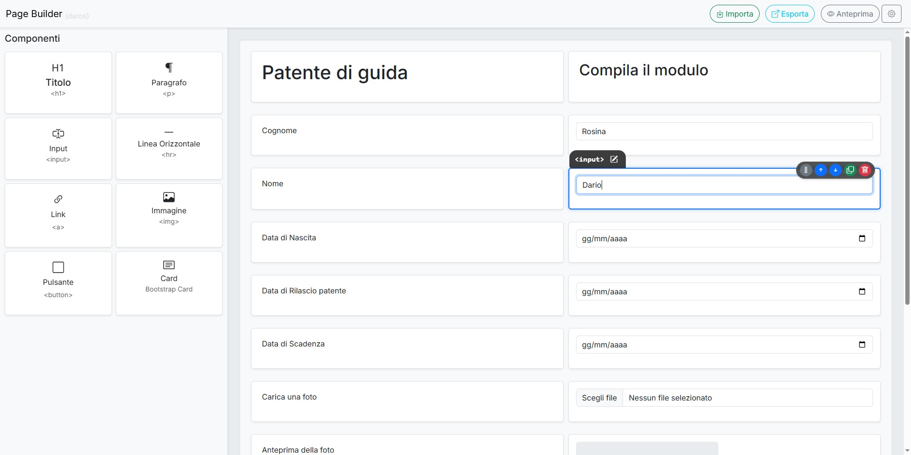

# Page Builder VanillaJS (daros)

Un semplice Page Builder drag-and-drop realizzato interamente in Vanilla JavaScript, con il supporto di Bootstrap per la struttura e lo stile.

## Descrizione

Questo progetto è un'applicazione web che permette di costruire layout di pagine HTML visivamente, trascinando componenti predefiniti su un'area di lavoro (canvas). Offre funzionalità di base per l'editing, l'anteprima e l'esportazione del codice HTML generato.

**Demo Online:** Prova la versione live qui: [https://page-builder-daros.vercel.app/](https://page-builder-daros.vercel.app/)

## Caratteristiche Principali

*   **Drag & Drop:** Trascina i componenti disponibili dalla barra laterale direttamente sul canvas per costruire la tua pagina.
*   **Editing dei Componenti:** Modifica le proprietà dei componenti aggiunti (testo, attributi, stili) facendo doppio click su di essi o utilizzando il pulsante "Modifica" nella Info-Box che appare alla selezione.
*   **Importazione HTML:** Incolla codice HTML esistente per aggiungere elementi al canvas. **Nota:** Attualmente, l'importazione supporta solo l'aggiunta di elementi di primo livello (non strutture nidificate complesse all'interno di un singolo blocco importato).
*   **Anteprima Live:** Visualizza un'anteprima in tempo reale della pagina che stai costruendo in una finestra modale.
*   **Esportazione HTML:** Genera ed esporta il codice HTML pulito corrispondente al layout creato sul canvas.
*   **Vanilla JavaScript:** Scritto interamente in JavaScript puro, senza dipendenze da framework JS esterni (come React, Vue, Angular, jQuery, ecc.).

## Dipendenze

*   **Bootstrap 5:** Utilizzato per la griglia, i componenti UI (modali, bottoni, card, ecc.) e lo stile generale.
*   **Bootstrap Icons:** Utilizzato per le icone nell'interfaccia.

## Come Funziona

1.  **Aggiunta Componenti:** Seleziona un componente dalla barra laterale sinistra (es. Titolo, Paragrafo, Immagine) e trascinalo nell'area del canvas a destra.
2.  **Editing:** Fai doppio click su un componente nel canvas o selezionalo e clicca "Modifica" per aprirne le opzioni specifiche (es. cambiare il livello di un titolo, l'URL di un link, il tipo di un input).
3.  **Configurazione Layout:** Clicca sull'icona a forma di ingranaggio (<i class="bi bi-gear"></i>) per accedere alle impostazioni e definire la struttura delle colonne del layout principale.
4.  **Importazione:** Usa il pulsante "Importa" per incollare codice HTML. Gli elementi riconosciuti verranno aggiunti al canvas.
5.  **Anteprima:** Clicca su "Anteprima" per vedere come apparirà la pagina finale.
6.  **Esportazione:** Clicca su "Esporta" per ottenere il codice HTML della pagina creata, pronto per essere copiato.

## Limitazioni Attuali

*   L'importazione HTML gestisce principalmente elementi singoli o strutture semplici. L'incollamento di codice HTML complesso e profondamente nidificato potrebbe non essere interpretato correttamente come un unico componente trascinabile.
*   Le opzioni di personalizzazione dei componenti sono ancora in fase di sviluppo.

---

_Sviluppato da [dariorosina](https://github.com/dariorosina)_